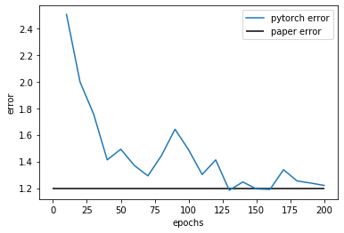

# TI-pooling-pytorch


This repository contains PyTorch implementations of TI-pooling (transformation-invariant pooling) from the following paper:
 - "TI-pooling: transformation-invariant pooling for feature learning in Convolutional Neural Networks" D. Laptev, N. Savinov, J.M. Buhmann, M. Pollefeys, CVPR 2016. [Pdf](http://laptev.ch/files/laptev16_cvpr.pdf), bibtex:

```
@inproceedings{laptev2016ti,
  title={TI-POOLING: transformation-invariant pooling for feature learning in Convolutional Neural Networks},
  author={Laptev, Dmitry and Savinov, Nikolay and Buhmann, Joachim M and Pollefeys, Marc},
  booktitle={Proceedings of the IEEE Conference on Computer Vision and Pattern Recognition},
  pages={289--297},
  year={2016}
}
```

The original paper provides experimental evaluation on three datasets. This repository contains source codes for one of these experiments: [mnist-rot dataset](http://www.iro.umontreal.ca/~lisa/twiki/bin/view.cgi/Public/MnistVariations), consisting of 12k training images of randomly rotated digits.

This implementation is inspired by the authors original implementation: https://github.com/dlaptev/TI-pooling 
The performance is similar to the one reported in the paper.



### What is TI-pooling?
TI-pooling is a simple technique that allows to make a Convolutional Neural Networks (CNN) transformation-invariant. I.e. given a set of nuisance transformations (such as rotations, scale, shifts, illumination changes, etc.), TI-pooling guarantees that the output of the network will not to depend on whether the input image was transformed or not.

### Why TI-pooling and not data augmentation?
Comparing to the very commonly used data augmentation, TI-pooling finds canonical orientation of input samples, and learns mostly from these samples. It means that the network does not have to learn different paths (features) for different transformations of the same object. This results in the following effects:
  * CNN with TI-pooling achieves similar or better results with smaller models.
  * Training is often done faster than for networks with augmentation.
  * It imposes internal regularization, making it harder to overfit.
  * It has theoretical guarantees on transformation-invariance.

### How does TI-pooling work?


  * First, input image (a) is transformed according to the considered set of transformations to obtain a set of new image instances (b).
  * For every transformed image, a parallel instance of partial siamese network is initialized, consisting only of convolutional and subsampling layers (two copies are shown in the top and in the bottom of the figure).
  * Every instance is then passed through a sequence of convolutional (c, e) and subsampling layers (d), until the vector of scalars is not achieved (e). This vector of scalars is composed of image features learned by the network.
  * Then TI-pooling (element-wise maximum) (g) is applied on the feature vectors to obtain a vector of transformation-invariant features (h).
  * This vector then serves as an input to a fully-connected layer (i), possibly with dropout, and further propagates to the network output (j).
  * Because of the weight-sharing between parallel siamese layers, the actual model requires the same amount of memory as just one convolutional neural network.
  * TI-pooling ensures that the actual training of each features parameters is performed on the most representative instance.

### Any caveats?
One needs to be really sure to introduce transformation-invariance: in some real-world problems some transformation can seem like an nuisance factor, but can be in fact useful. E.g. rotation-invariance does not work well for natural objects, because most natural objects have a "default" orientation, which helps us to recognize them (an upside-down animal is usually harder to recognize, not only for a CNN, but also for a human being). Same rotation-invariance proved to be very useful for cell recognition, where orientation is essentially random.

Also, while training time is comparable and usually faster than with data augmentation, the testing time increases linearly with the number of transformations.

### Instructions for Linux
First run `./setup.sh` to download the dataset, it will be stored in the root directory. Then, depending on the framework you want to use, navigate to the corresponding directory and start training by calling `rot_mnist12K` file.

  * For PyTorch: `python rot_mnist12K.py`